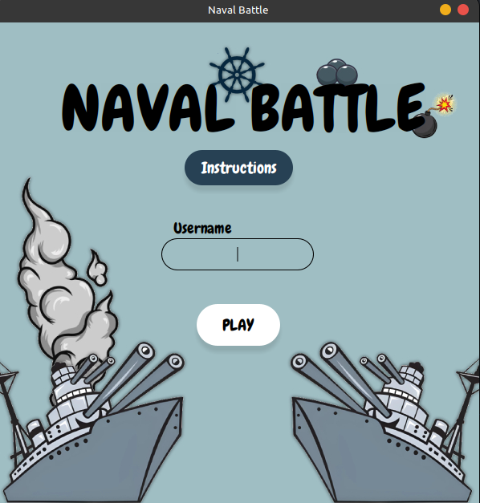
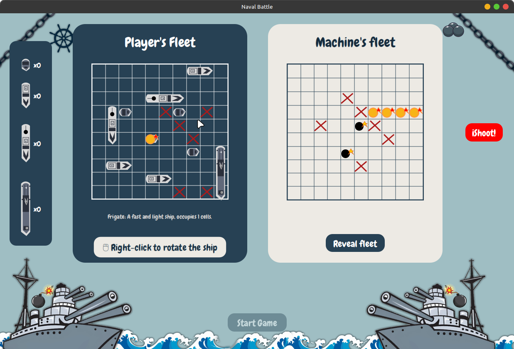

# Naval Battle Game

<p align="center">
    
</p>

<p align="center">
    
</p>

Naval Battle game is an interactive desktop application 
inspired by the classic battleship game. Designed with
a modern twist, this JavaFX-based application provides 
players with an engaging experience, allowing them to develop
a strategy, attack and conquer their opponent's fleet. 

## 🗝️ Key Features

- **Interactive Gameplay**: Classic battleship mechanics 
with digital upgrade.
- **Fleet Management**: Place ships on your grid with visual 
feedback.
- **Dynamic Fleet Reveal**: Reveal or hide the machine's fleet
using a "secure" keyword verification.
- **Save and Resume**: Automatically saves the game's board 
state and player progress, allowing players to resume at 
any time.
- **Custom Graphics**:
  - Animated bombs, fires, and water splashes.
  - Visuals for destroyed ships dynamically drawn with
  JavaFX shapes.

## 💻 Tech Stack
- ☕ [Java](https://docs.oracle.com/en/java/) - Main Programming Language
- 🏖️ [JavaFX](https://openjfx.io/) - Framework for GUI development
- 🎨 [CSS](https://www.w3.org/Style/CSS/) - For custom styling
- ✏️ [Git](https://git-scm.com/) - Version control manager

## 🗺️ Future Ideas
- **Improved User Interface**:
  - Add sound effects for actions like attacks and ship destruction.
- **Multiplayer Mode**: Implement a local multiplayer feature to
increase re-playability.
- **Statistics Tracking**: Record and display game statistics, such
as win rates and average game duration.
- **Testing**: Add unit tests for game mechanics to ensure robustness.
- **Deployment**: Package the game as an executable JAR file 
or installer for easier distribution.

## 🚀 How to run
1. Clone the repository:
   ```bash
   git clone https://github.com/NogueraMateo/Naval-Battle.git
   ```
2. Open the project in your preferred Java IDE (e.g., Intellij IDEA).
3. Build and run the project:
   - Ensure JavaFX is configured correctly in your environment.
   - Run the `HelloApplication`class to start the application.
